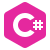

###

  <h3 align="left"> I'm learning </h3> 

###

  <code></code>
<!--    -->
  <code></code>
<!--    -->
  <code></code>
<!--    -->
  <code></code>
<!--    -->
  <code></code>
<!--     -->

###

  <h3 align="left"> I want to learn </h3> 

###

  <code></code>
<!--    -->
    <code></code>
<!--    -->
    <code></code>
<!--    -->
    <code></code>
<!--    -->
    <code></code>
<!--    -->
    <code></code>
<!--    -->

 
<b>Hello, world!🎀<b>  
My name is Yana, and I am a beginner full-stack developer. I am just starting my journey in this amazing and challenging profession, but I have already fallen in love with it wholeheartedly.
I chose full-stack development because it allows me to combine my interests in programming, design, and database work. I want to create complete web applications and services that will be useful to people and help them solve their problems.
I try to constantly learn and develop myself to stay up to date with the latest trends and technologies in the development world.
I am open to new ideas and ready to work on interesting projects. I am confident that my experience and knowledge will help me become a good full-stack developer and contribute to the development of the industry.
I look forward to answering your questions and discussing opportunities for cooperation.🌸

  
  

###
